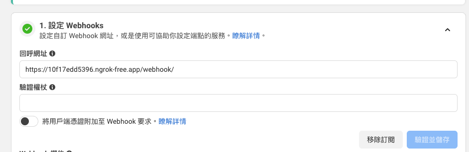
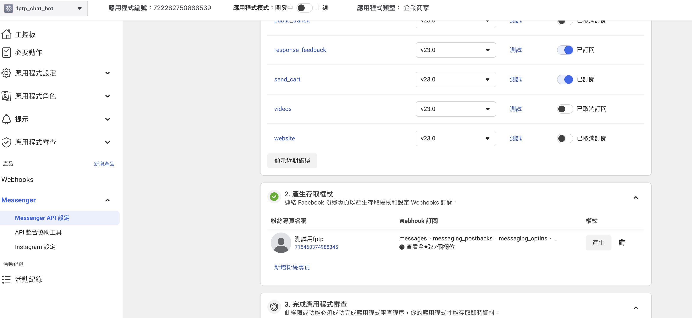

# Facebook Messenger Chatbot

**Note: This project is currently in active development and not yet production-ready.**

A Facebook Messenger chatbot built with Flask and OpenAI. This bot enables automated conversations on Facebook pages, leveraging OpenAI's language models. Easily extensible for custom workflows and NLP tasks.

## Features
- Facebook Messenger webhook integration
- OpenAI GPT-based responses
- Easy local development with ngrok
- Secure token management
- Modular, extensible Python codebase

## Table of Contents
1. [Reference](#reference)
2. [Setup](#setup)
3. [Running the Application](#running-the-application)
4. [Environment Variables](#environment-variables)
5. [Webhook Configuration](#webhook-configuration)
6. [Troubleshooting](#troubleshooting)
7. [Useful Links](#useful-links)

## Reference
Based on: [jellyfangs/messenger-bot-tutorial](https://github.com/jellyfangs/messenger-bot-tutorial)

---

## Setup

1. **Clone the repository and enter the project directory:**
   ```bash
   git clone https://github.com/benintw/Messenger-chatbot-with-AI.git fb_chatbot
   cd fb_chatbot
   ```
2. **Install Python (recommended: Python 3.11+)**
3. **Install dependencies using uv:**
   ```bash
   pip install uv
   uv sync
   ```

## Running the Application

### 1. Start the Flask server
```bash
uv run python run.py
```
By default, the server runs on port 5001.

### 2. Start ngrok to expose the local server
```bash
ngrok http 5001
```
After starting ngrok, you will receive a public URL (e.g., `https://10f17edd5396.ngrok-free.app`).

---

## Environment Variables
Create a `.env` file or export these variables in your shell:

- `FB_PAGE_ACCESS_TOKEN` – Your Facebook Page Access Token ([see below](#useful-links))
- `FB_VERIFY_TOKEN` – Any string; must match the value set in Facebook Webhook settings
- `OPENAI_API_KEY` – Your OpenAI API key

Example `.env`:
```env
FB_PAGE_ACCESS_TOKEN=your_fb_page_token
FB_VERIFY_TOKEN=your_custom_verify_token
OPENAI_API_KEY=your_openai_key
```

---

## Webhook Configuration

1. Visit your Facebook app's Messenger settings:
   [Messenger API Settings](https://developers.facebook.com/apps/722282750688539/messenger/messenger_api_settings/)
2. Update the webhook URL to your current ngrok URL, appending `/webhook/` (e.g., `https://10f17edd5396.ngrok-free.app/webhook/`).
3. Ensure the verify token matches `FB_VERIFY_TOKEN` above.



---

## Useful Links
- 
- [Messenger API Settings](https://developers.facebook.com/apps/722282750688539/messenger/messenger_api_settings/)

---

## Troubleshooting
- Every time you restart ngrok, you get a new URL. Update your webhook in Facebook settings accordingly.
- If the webhook fails verification, double-check your `FB_VERIFY_TOKEN` value.
- Ensure all environment variables are set before running the server.

---

For additional help, see the [reference tutorial](https://github.com/jellyfangs/messenger-bot-tutorial).

